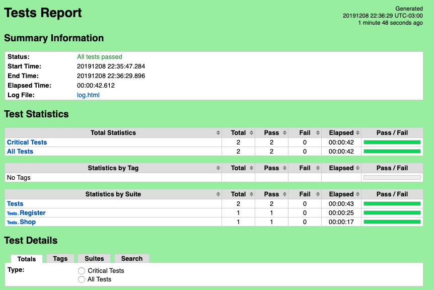
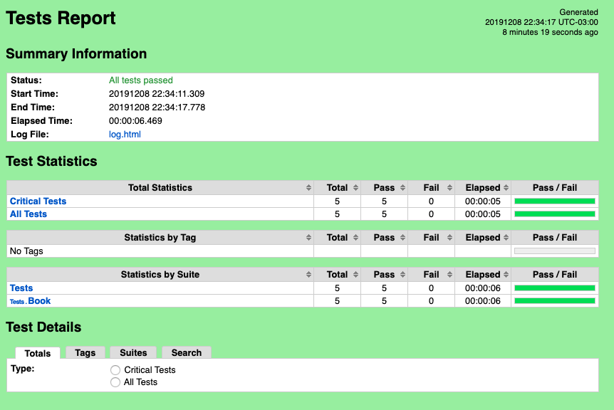

# Robot and Python project for Ui and API tests #

## Installation  ##
Make sure you have [Python3](https://realpython.com/installing-python/) environment set up.

Make sure you have installed [pip](https://pip.pypa.io/en/stable/installing/)

Install the following packages:
```
pip3 install robotframework
pip3 install robotframework-seleniumlibrary
pip3 install webdrivermanager
sudo webdrivermanager firefox chrome --linkpath /usr/local/bin

pip3 install -U requests
pip3 install  robotframework-requests
pip3 install --upgrade RESTinstance
pip3 install --upgrade robotframework-pageobjectlibrary
pip3 install jsonpath
```
After cloning the repository, navigate to the root folder robot.
## Executing tests ##
Running ui tests:
```
robot ui_test/tests
```

Running api tests:
```
robot api_test/tests
```

## Report is generated as bellow ##

### UI test results ###



###API test results ###


